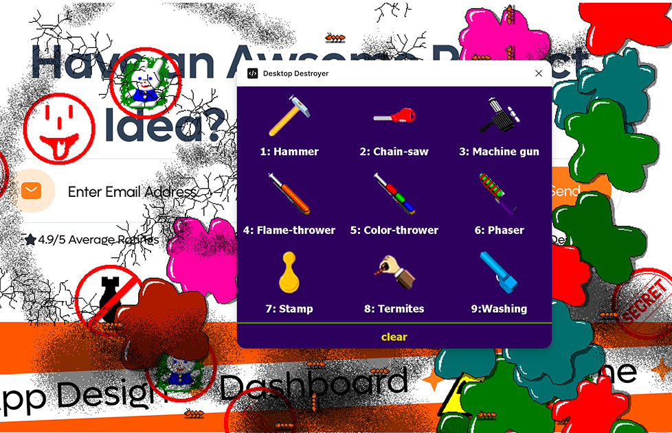

# Desktop Destroyer for Figma



The 1990s freeware stress-reliever, rebuilt as a Figma plugin. Pick a weapon from the
3x3 menu, drag it across your canvas, and leave a mess of real Figma nodes behind.

Nine weapons: hammer, chain-saw, machine gun, flame-thrower, colour-thrower, phaser,
stamp, termites, and a washing sponge. All nine work, in **Figma Design and FigJam**.

## Get it

There's no Figma Community listing — this is a development plugin, so you run it from
source.

**You'll need:**

- The **Figma desktop app**. Importing a local plugin reads a file off your disk, which
  the browser version can't do.
- **Node 18 or newer** (built and tested on Node 22).
- Git.

**1. Clone and build:**

```
git clone https://github.com/chiafigma/desktop-destroyer.git
cd desktop-destroyer
npm install
npm run build
```

Don't skip `npm run build`. `manifest.json` points at `dist/main.js` and `dist/ui.html`,
and `dist/` isn't checked in — so a fresh clone has nothing to load until you've built it
once.

**2. Import it into Figma:**

1. Open the **Figma desktop app** and open any Design or FigJam file.
2. Go to **Plugins → Development → Import plugin from manifest…**
3. Choose the `manifest.json` at the root of your clone.

**3. Run it:** the plugin now appears under **Plugins → Development → Desktop Destroyer**.
Click it to launch. After that, `⌥⌘P` re-runs it.

**To update later:**

```
git pull
npm install
npm run build
```

Then re-run the plugin. Figma doesn't hot-reload, so a rebuild alone won't change what's
already open.

## How to play

1. **Click a weapon** to arm it. It appears on the canvas and follows your cursor.
2. **Drag across the canvas.** Damage appears as you move.
3. **Click the same weapon again** to holster it.
4. **`clear`** in the footer wipes the mess.

| Input | Does |
| --- | --- |
| Click a weapon | Arm it. Click it again to holster. |
| `clear` (footer) | Remove every mark the plugin has ever left |
| `1`–`9` | Arm by slot |
| `C` | Clear |
| `P` | Cursor-tracking diagnostics |

Keyboard shortcuts only fire while the plugin window itself holds focus — and the moment
your cursor moves onto the canvas, which is the entire point of this plugin, Figma gets
the keystroke instead. So the shortcuts are a convenience and never the only route to
anything. Everything that matters is one click away in the menu.

### Two things that will surprise you

**There is no "hold to fire."** Figma doesn't tell plugins where your cursor is over the
canvas, and it certainly doesn't say whether the button is down — the plugin infers your
cursor from the multiplayer presence channel, which reports position and nothing else. So
weapons fire on *distance moved* instead. Drag and you spend damage; hold still and you
spend nothing. Park the cursor mid-canvas and walk away and the file stays clean.

**`clear` isn't scoped to this session.** Every mark is tagged as belonging to this
plugin, and clearing sweeps the whole document for that tag, across every page. Reopen
the plugin onto yesterday's mess and `clear` still finds it — which is exactly the state
you're in when you open the plugin to an already-covered canvas. It never touches
anything the plugin didn't create.

## The nine weapons

| | Weapon | What it leaves behind |
| --- | --- | --- |
| 1 | Hammer | Eight different cracks, one thud each |
| 2 | Chain-saw | A continuous kerf with sawdust along it. The blade turns to face the way you cut. |
| 3 | Machine gun | Bullet holes, rattling |
| 4 | Flame-thrower | A fireball that blooms and burns out, leaving scorch marks. Sustained roar. |
| 5 | Colour-thrower | Paint splats — five sprites repainted into eight colours, so 40 distinct splats |
| 6 | Phaser | Big scorched blast craters |
| 7 | Stamp | Ten different stamped impressions |
| 8 | Termites | Live termites that land and then **crawl around your file** |
| 9 | Washing | Wet smears and a sustained spray |

Most weapons drop a still image and leave it there — no animation, no timers. That's how
the original worked too, and it's what makes a hundred marks cheap. Four weapons break
that rule and are the interesting ones:

- **The chain-saw draws a line, not points.** It's the only mark that's about the path you
  took rather than the points on it, and its blade rotates through eight compass headings
  to face the direction of travel.
- **Termites keep moving after they land.** A real crawl simulation, stepping every 140ms.
- **The colour-thrower repaints its own art.** All five splats ship as the same pure red,
  so recoloured copies are baked at startup to get 40 marks out of 5 sprites.
- **The flame-thrower throws fire that doesn't stick.** The fireball animates and removes
  itself, and the permanent scorch is held back so the fire gets there first.

Tuning numbers for all nine — fire rate, travel per mark, sprite geometry — live in
[docs/weapons.md](docs/weapons.md), which is checked against the real files by
`npm run verify`.

⚠️ **A warning about the termites.** They're the one thing here that can genuinely bog a
file down. Each is a node being moved every 140ms, there's no cap on how many you place,
and the cost never comes back down on its own. A few dozen is comfortable; several
hundred will make the file sluggish. `clear` is the release valve, and closing the plugin
stops the crawl.

## Nothing leaves your machine

`networkAccess` is `none`. Every sprite and sound is baked into the bundle at build time,
so the plugin has no reason to talk to the network and no permission to.

## Commands

| Command | Does |
| --- | --- |
| `npm run build` | Inline assets, build `dist/main.js` and `dist/ui.html` |
| `npm run dev` | Same, watching. Figma does not hot-reload — re-run the plugin (`⌥⌘P`) to pick up a change. |
| `npm run verify` | Check every declared sheet and hit against the real PNG on disk |
| `npm test` | `node:test` over `src/shared/**/*.test.ts` |
| `npm run typecheck` | All three tsconfigs — main, UI and test are checked separately, on purpose |
| `npm run check` | Build, verify, typecheck, test. Run before calling anything done. |
| `npm run assets` | Regenerate icon sets from `assets/icons-src` (needs ImageMagick; not part of the build) |

## Where things live

```
src/shared/   weapon registry, trail math, UI<->main protocol  (no Figma, no DOM)
src/main/     sandbox: cursor polling, node creation, damage, the crawl
src/ui/       iframe: menu replica, sprite slicing, paint baking, audio
assets/       menu icons — ours, generated from assets/icons-src
ref/w93/      vendored sprite sheets and sounds, one directory per weapon
ref/          older rip and upstream weapon configs, kept for reference
scripts/      esbuild bundler + asset inliner, sheet verifier, icon normalizer
docs/         the technical write-up
```

## Docs

Start with **[docs/how-it-works.md](docs/how-it-works.md)** — the short technical tour:
why the plugin has to poll your cursor, why damage costs distance instead of time, what
runs where, and how the menu was reconstructed.

Then, in increasing depth:

- [docs/architecture.md](docs/architecture.md) — the two-thread split and why the compiler enforces it, cursor polling, the trail math, the firing loop, the crawl, clearing, known loose ends
- [docs/weapons.md](docs/weapons.md) — the weapon declaration field by field, tuning `minTravel` and offsets, the special cases, adding a weapon
- [docs/assets.md](docs/assets.md) — the pipeline from source PNG to inlined data URI, the asset maps, build output
- [docs/protocol.md](docs/protocol.md) — every message crossing the boundary, `FramePayload`, `ProbeStats`

## Credits

Desktop Destroyer was originally designed by **Miroslav Němeček**
([gemtree.com](http://www.gemtree.com/program.htm)). The sprites and sounds used here come
from the [windows93.net](https://windows93.net) recreation — ripped by **Jankenpopp** and
**Zombectro**, with that version's code by **Zombectro**.

This is an unofficial fan port built for MakerWeek. It vendors that artwork under
`ref/w93/` rather than recreating it, and carries no licence of its own because that
artwork isn't ours to license. Full provenance in
[docs/attribution.md](docs/attribution.md).
